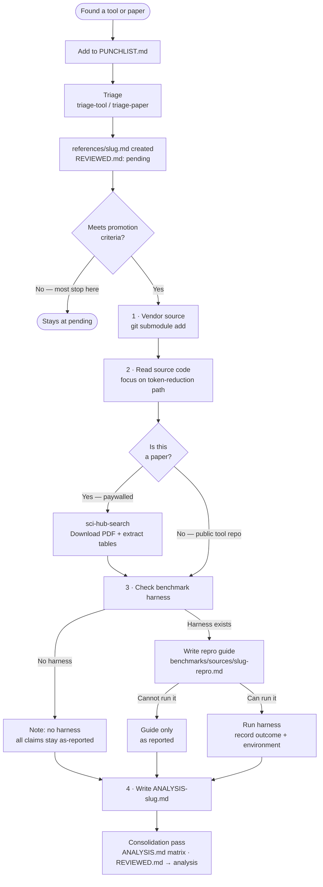

# Contributing to agentic-context

This repo collects, triages, and analyzes tools and papers related to context management in agentic LLM systems. Contributions take three forms: adding candidates to the queue, triaging a candidate into a reference summary, and promoting a reference to a full analysis.

---

## Pipeline overview



---

## Before you start

- Read `ANALYSIS.md` — the comparison matrix tells you what's already been analyzed.
- Check `PUNCHLIST.md` — the queue of candidates waiting for triage.
- Check `REVIEWED.md` — the log of everything already examined (analysis or skipped).

Do not add something that's already in the queue or already reviewed.

---

## Adding a candidate to the queue

Found a tool or paper worth looking at? Add it to `PUNCHLIST.md`:

```md
- [ ] https://github.com/author/repo — one-line reason why it's relevant
```

That's all. An agent or another contributor can pick it up later.

---

## Triage

Triage turns a candidate into a structured reference file at `references/{slug}.md`. It also adds a row to `REVIEWED.md` and `REFERENCE_INDEX.md`.

**For tools:** the `tessl__triage-tool` skill handles this. Pass it a GitHub URL, npm package, or PyPI package name.

**For papers:** the `tessl__triage-paper` skill handles this. Pass it an arxiv ID, DOI, or PDF.

If you're doing it manually, a reference file needs:

- YAML frontmatter with `title`, `date`, `type` (tool or paper), `tags`, `source` (URL), `version`, `context` (why it's relevant)
- A TL;DR (5–7 bullets)
- Architecture overview
- Self-reported metrics (marked `(as reported)`)
- Open questions

All claims at triage stage are `(as reported)`. Do not present README figures as facts.

---

## Promoting a reference to ANALYSIS

Most references stay at `pending`. Promote to ANALYSIS when:

- The tool is a strong adoption candidate and its benchmark claims need checking.
- Self-reported metrics are unusually high (>80% reduction) with no disclosed methodology.
- The mechanism is novel enough to warrant a code-level write-up.
- A direct comparison between two already-triaged tools is needed.

**Do not promote just because triage is done.**

### Steps

1. **Vendor the source** — add the repo as a git submodule:

   ```sh
   git submodule add <repo-url> tools/<slug>
   ```

   Pin to the commit you examined. Record `local_clone: ../tools/<slug>` in the reference frontmatter.
   If you skip vendoring (link-only), treat all findings as `(as reported)` regardless of how confident you feel — you do not have a local copy to verify against.

2. **Read the source.** Focus on: the token-reduction critical path, data structures, benchmark harness location (`benchmarks/`, `eval/`, `tests/`).

3. **Check the benchmark harness.** If one exists, write `benchmarks/sources/{slug}-repro.md` documenting the methodology and how to run it — this is a **repro guide**, not a reproduction. If you can actually run the harness, record the outcome and environment (**repro result**) and mark with `(verified)` or `(attempted — inconclusive)`. If you only wrote the guide, everything stays `(as reported)`.

4. **Write `analysis/ANALYSIS-{slug}.md`.** See "Analysis document format" below.

5. **Update `ANALYSIS.md`** — add a row to the comparison matrix and a line in the reading order.

6. **Update `REVIEWED.md`** — change disposition from `pending` to `analysis`.

---

## Analysis document format

Sections in order:

1. YAML frontmatter
2. `## Summary` — 2–4 sentences; key self-reported metrics marked `(as reported)`
3. `## What it does (verified from source)` — subsections: Core mechanism, Interface / API, Dependencies, Scope / limitations
4. `## Benchmark claims — verified vs as-reported` — table with a Status column
5. `## Architectural assessment` — What's genuinely novel; Gaps and risks
6. `## Recommendation` — adopt / evaluate / do not adopt; conditions
7. `## Comparison hooks (for ANALYSIS.md matrix)` — table of dimensions matching the matrix columns

Use the terminology defined in `AGENTS.md` (context window, working context, injection, compression, truncation, eviction, tiered loading) consistently.

---

## Claim hygiene

The single most important rule: **never present a self-reported metric as a fact you verified**.

- `(as reported)` — the tool or paper claims this; you did not verify it.
- `(verified from source)` — you read the code and confirmed the mechanism.
- `(verified)` — you ran the benchmark harness and got this result.
- `(attempted — inconclusive)` — you ran the harness but results were inconclusive.

Common traps found in practice:

- **Bytes ≠ tokens.** Some tools measure compression in raw bytes. Always check what the denominator is.
- **Narrow benchmarks.** A 95% figure on 3 small repos is not a 95% figure in general. Note the scope.
- **Non-real tokenizers.** Several tools use `chars / 4` or `chars / 3.5` as a token estimate. These are heuristics, not tiktoken or cl100k.
- **Hot-path vs cold-path speedups.** A stated speedup may apply to a function that is not on the production critical path.
- **Savings accounting flaws.** Some tools count all content in matched documents, not just the content they return.

---

## Commits

Conventional commit messages:

- `feat:` — new capability or tool added to the repo infrastructure
- `docs:` — reference files, triage entries, PUNCHLIST updates
- `analysis:` — new or updated ANALYSIS files and benchmark repros
- `chore:` — config, tooling, CI
- `fix:` — corrections to existing files

One logical change per commit. Do not batch unrelated reference additions.

---

## Lint

The pre-commit hook runs `mdlint`. It is strict and context-unaware. Rules that catch people:

- **YAML frontmatter lists** — `source:` must be a scalar string (`source: "path"`) or flow-style list (`source: ["p1", "p2"]`). A YAML block list (`source:\n  - "..."`) triggers MD032.
- **Code fences** — must have a language specifier: ` ```sh `, ` ```text `, ` ```python `, etc.
- **Code fences inside list items** — blank line required before and after the fence markers.
- **No inline HTML** — `<code>`, `<br>`, etc. are not allowed.
- **Double underscores** — two consecutive underscores anywhere in the file trigger MD050, including inside code spans. Rewrite directory paths that start with double underscores (e.g. write `tests/evaluation/runner.ts` rather than including the leading double-underscore prefix).
- **Duplicate headings** — if two sections in the same file share a heading name (e.g. two `### Status` blocks), rename one to make them unique.
